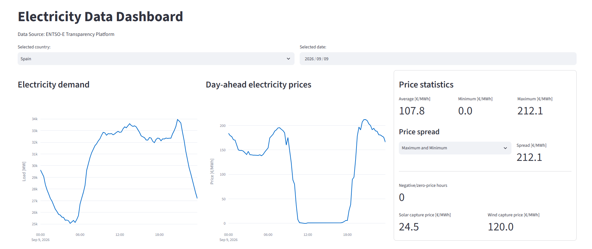
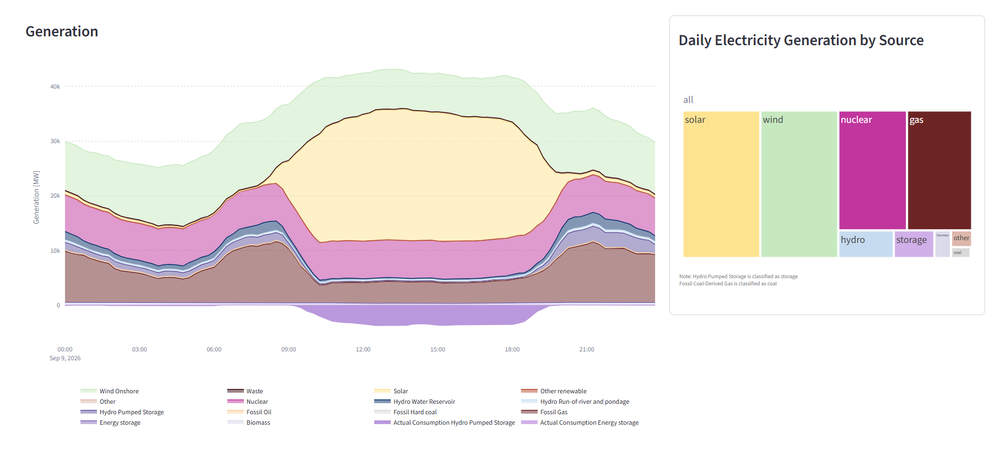

# Electricity Data Dashboard

An end-to-end electricity data pipeline and interactive dashboard built with **Python, Oracle, Docker, GitHub Actions and Streamlit**.

This project was developed as a practical exercise in combining **electricity markets, data engineering and software development**.

The project retrieves electricity-market data from the **ENTSO-E Transparency Platform**, processes and stores it in an Oracle database, and makes it available through an interactive dashboard for exploring electricity prices, demand and generation.

> 🚧 **Work in progress** — the project is continuously being extended with additional energy-market indicators and analysis.

## Data source

The electricity data used in this project comes from the **ENTSO-E Transparency Platform**.

The project is intended for educational and analytical purposes and is not intended for real-time electricity-market trading or operational decision-making.

## Dashboard

The dashboard provides an interactive view of electricity-market data, including:

* Day-ahead electricity prices
* Electricity demand
* Generation by technology
* Renewable generation
* Battery/storage activity
* Daily price statistics
* Generation and price trends over time

The aim is to go beyond displaying raw data and provide indicators that can help analyse the relationship between **electricity prices, demand and the generation mix**.

## Data pipeline

Electricity data is retrieved from the **ENTSO-E Transparency Platform** and loaded to an Oracle database.

The pipeline handles data such as:

* Day-ahead electricity prices
* Electricity load
* Generation by production type

Relevant prices and generation daily statistics are also loaded to Oracle so that they can later be quickly retrieved.

The ETL pipeline is automated with **GitHub Actions**, which periodically retrieves new data and loads it into the database.

## Automated workflow

The production ETL is scheduled through **GitHub Actions**.

The workflow:

1. Retrieves the relevant electricity data from ENTSO-E.
2. Processes and validates data from the previous day and up to three days ago - data from ENTSO-E API presents sometimes missing or faulty data and is modified in the subsequent days.
3. Loads the data into Oracle.
4. Makes the updated data available to the Streamlit dashboard.

This allows the dashboard to be updated automatically without manually running the ETL process.

## Future improvements

The project is still evolving. Planned improvements include:

* Expanding the dashboard to additional countries
* Handle countries with more than a bidding zone
* Adding historical price statistics and comparisons
* Adding renewable capture-price analysis
* Expanding electricity-market indicators
* Adding further data-quality checks
* Improving ETL monitoring and error handling
* Adding additional analysis of the relationship between generation mix, electricity demand and electricity prices
